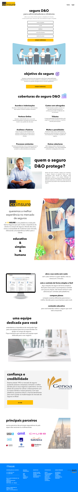

# Teste Coinsure - Frontend Web Developer

* avaliar suas habilidades como frontend, no quesito de replicar layouts
* Utilizar a biblioteca React para construção da landing page

## Diferenciais

* Fazer uso de componentização
* Responsividade

## Outras observações

* Tempo de entrega: 2 dias a partir da entrevista
* você podera entregar como .zip ou subir no github e enviar o link do repositório para os seguintes emails: rodrigo.tanaka@genoaseguros.com.br ou rodrigo.pedroni@genoaseguros.com.br
* As imagens se encontram na pasta img e os textos da lp estão no arquivo .txt

## Boa sorte candidato, a imagem da Lp está no repositorio mas deixarei aqui para possíveis consultas.

